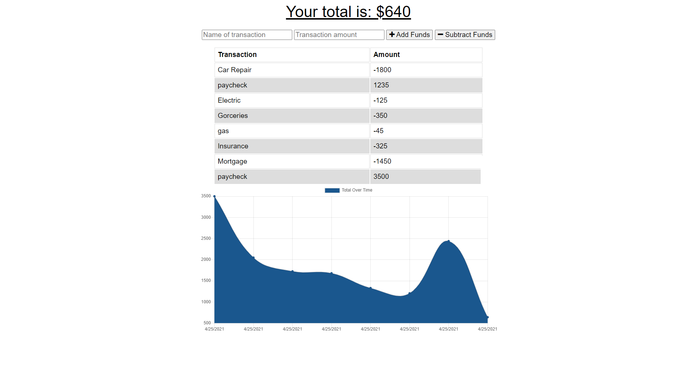

<h1 align="center"> Budget Tracker Challenge </h1>
  
  

    
  
  
  
  

    
    
    
    
  

   

        
    
     
  

  
  ## Description
  ❓  A budget tracker application where the user will be able to add expenses and deposits to their budget with or without a connection. 

  

  ## Table of Contents
  - [Description](#description)
  - [Installation](#installation)
  - [Usage](#usage)
  - [Repository](#repository)
  - [License](#license)
  - [Contributors](#contributors)  
  - [Questions](#questions)

  ## Installation
  🚨 You will need to install the application's dependencies:
    `npm i`  

  
  ## Usage
  🚀 
  
   From your terminal, type the following command to start the server:
    
   `node server.js`
   Then click on the Heroku Badge in this README.md to access the application.

  ## Repository
  :octocat: [Budget Tracker](https://github.com/Govepitr/BudgetTrackerChallenge) 
   
  

  ## License
  
   
  This application is covered by the MIT license.

  ## Contributors
  👥  
   
  :octocat: [Dan Arbelo](https://github.com/govepitr) 
  :octocat: [Kashay Arbelo](https://github.com/KashCodes) 

  

  ## Questions
  :question: You may reach out to me at the below links: 
     
    :octocat: Find me on GitHub: [Govepitr](https://github.com/Govepitr) 
     
    📜 Feel free to email me with any questions: dan@arbelo.me  

  _This README was generated with the power of 💞 by ✨[Professional README Generator](https://github.com/Govepitr/ProfessionalREADMEGenerator) 🤘 🤘 🤘_